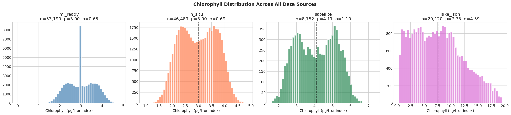
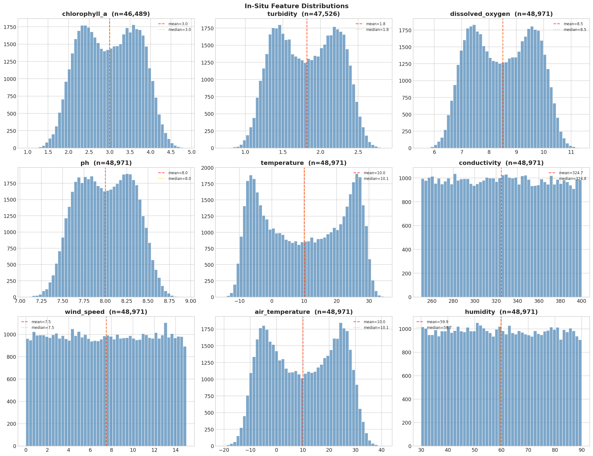
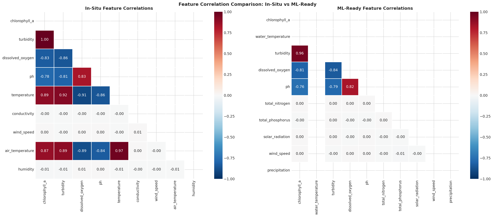
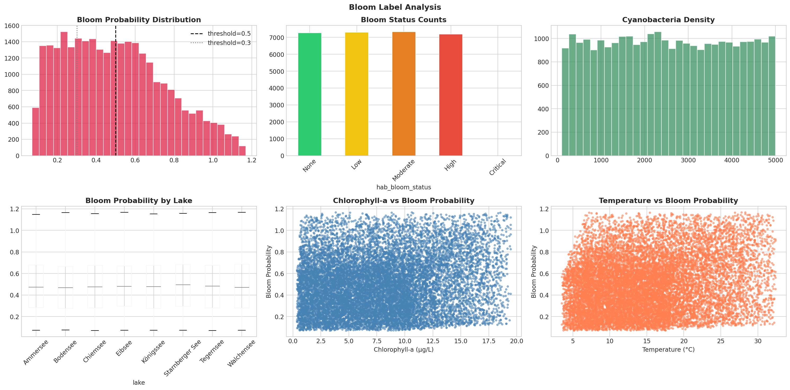
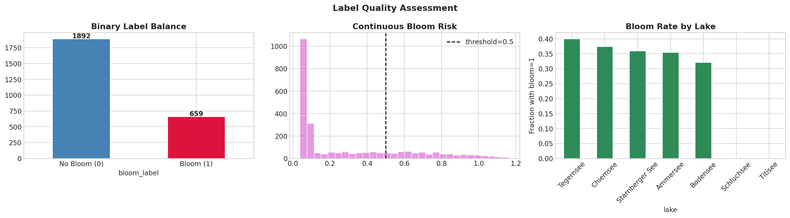
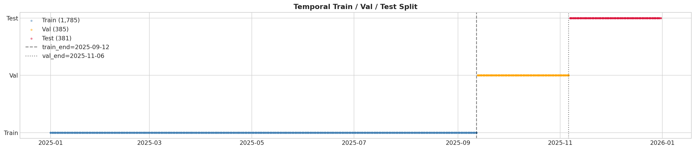
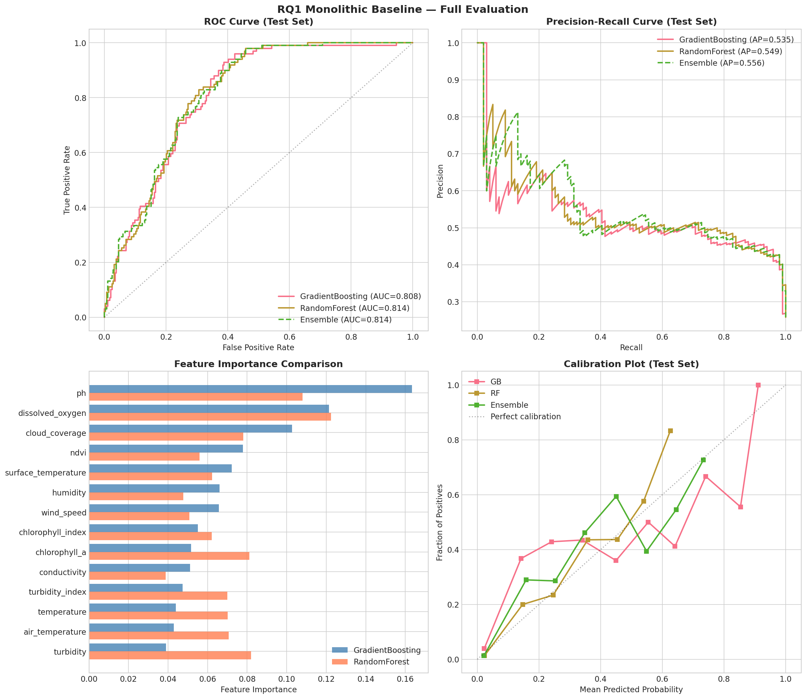
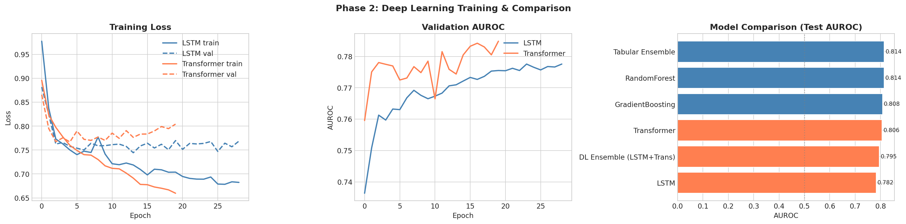
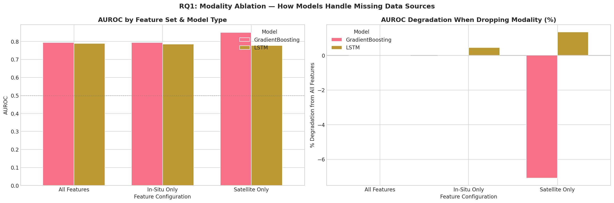
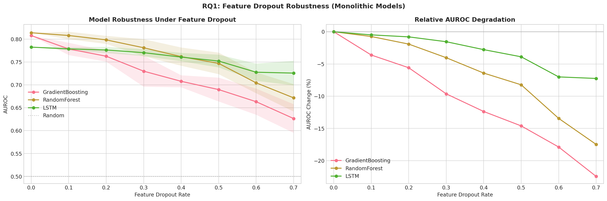

# SWIM Research Progress

**Status: Phase 3 Complete | Building Phase Paused**
**Last Updated: February 2026**

---

## Overview

This document tracks the research progress for the SWIM (Surface Water Intelligence & Monitoring) platform's PhD research angle: **"Agentic AI for Multi-Modal Earth Observation."**

The research investigates three questions:
- **RQ1**: Agent specialization vs monolithic models
- **RQ2**: Inter-agent communication protocols
- **RQ3**: Conflict-aware multi-agent fusion

---

## Completed Work

### Platform Engineering (Complete)

| Component | Status | Details |
|-----------|--------|---------|
| HOMOGEN Agent | Done | Data harmonization from CSV/Excel/API to standardized Parquet |
| CALIBRO Agent | Done | Sentinel-2 satellite calibration for chlorophyll-a and turbidity |
| VISIOS Agent | Done | Visual HAB detection from lake images using EXIF + color analysis |
| PREDIKT Agent | Done | Ensemble ML prediction (RF + GBM) with 3 forecast horizons |
| Orchestrator | Done | A2A-based agent chaining + calibrated risk fusion |
| REST API | Done | 12 endpoints with JWT + API key auth |
| RAG Pipeline | Done | Document ingestion, vector embeddings, context injection |
| Dashboard | Done | 8-tab Streamlit interface |
| Docker Deployment | Done | 5-container Docker Compose |
| Security | Done | Auth, rate limiting, input sanitization |
| Observability | Done | Prometheus metrics, structured logging, error tracking |
| Tests | Done | 112+ unit tests passing |

**Scale:** 14,000+ lines Python | 150+ modules | 5 agents | 12 API endpoints | 5 German lakes

---

### Research Phase 1: Data Audit & EDA (Complete)

**Notebook:** `notebooks/research_package/01_research_phase1_eda.ipynb`

**What was done:**
- Loaded and audited 4 data sources: in-situ water quality (48,971 rows), Sentinel-2 satellite (8,759 rows), lake JSON with bloom labels, DWD weather
- Merged into unified research dataset: **2,551 records across 7 German lakes**
- Created bloom labels from bloom_probability thresholds
- Identified data quality issues: water_temperature (100% zeros), precipitation (100% zeros)
- Trained baseline models with stratified split (temporal split failed due to seasonal bloom bias)
- Generated 8 publication-quality figures

**Key Results:**

| Model | AUROC | AUPRC | Brier Score |
|-------|-------|-------|-------------|
| GradientBoosting | 0.808 | 0.535 | 0.162 |
| RandomForest | 0.814 | 0.549 | 0.146 |
| Ensemble (GB+RF) | **0.814** | **0.556** | 0.149 |

**Data Characteristics:**
- 14 features (9 in-situ + 5 satellite)
- 25.8% bloom rate (imbalanced)
- 7 lakes: Bodensee, Starnberger See, Ammersee, Chiemsee, Muritz, Schluchsee, Titisee

**Phase 1 Figures:**

| Figure | Description |
|--------|-------------|
|  | Cross-source chlorophyll-a comparison |
|  | Temporal coverage across data sources |
|  | In-situ feature distributions |
|  | Feature correlation matrix |
|  | Bloom analysis by lake |
|  | Label quality assessment |
|  | Temporal vs stratified split analysis |
|  | Baseline model evaluation (ROC, PR, calibration) |

---

### Research Phase 2: Deep Learning Baselines (Complete)

**Notebook:** `notebooks/research_package/02_research_phase2_deep_learning.ipynb`
**GPU Used:** NVIDIA RTX A6000

**What was done:**
- Trained LSTM (2-layer, hidden=64) and Transformer (d_model=64, 4-head) classifiers
- Trained XGBoost alongside Phase 1 baselines for complete comparison
- Ran modality ablation: all features vs in-situ only vs satellite only
- Ran feature dropout robustness experiment (0-70% dropout, 10 trials each)

**Model Comparison (Test Set):**

| Model | AUROC | AUPRC | Brier |
|-------|-------|-------|-------|
| Tabular Ensemble (GB+RF) | **0.814** | **0.556** | 0.149 |
| RandomForest | 0.814 | 0.549 | **0.146** |
| GradientBoosting | 0.808 | 0.535 | 0.162 |
| Transformer | 0.806 | 0.514 | 0.199 |
| DL Ensemble (LSTM+Trans) | 0.795 | 0.491 | 0.195 |
| LSTM | 0.782 | 0.449 | 0.194 |

> Tabular models outperform deep learning (expected with N=2,551). Transformer beats LSTM.

**Modality Ablation (Surprise Finding):**

| Feature Config | GB AUROC | LSTM AUROC |
|---------------|----------|------------|
| All Features (14) | 0.794 | 0.789 |
| In-Situ Only (9) | 0.794 | 0.785 |
| Satellite Only (5) | **0.850** | 0.778 |

> Satellite-only GB (0.850) OUTPERFORMS all-features GB (0.794). Satellite features are the strongest predictors. Some in-situ features add noise.

**Feature Dropout Robustness:**

| Dropout Rate | GB | RF | LSTM |
|-------------|------|------|------|
| 0% | 0.808 | 0.814 | 0.782 |
| 30% | 0.730 | 0.783 | 0.770 |
| 50% | 0.690 | 0.746 | 0.750 |
| 70% | **0.634** | **0.674** | **0.723** |

> LSTM loses only 7.5% at 70% dropout vs GB losing 21.5%. Deep learning is more robust to sensor failure, but all monolithic models degrade substantially.

**Phase 2 Figures:**

| Figure | Description |
|--------|-------------|
|  | LSTM & Transformer training curves + model comparison |
|  | ROC and PR curves for all models |
|  | Modality ablation: AUROC by feature set |
|  | Feature dropout robustness curves (monolithic) |

---

### Research Phase 3: Agentic vs Monolithic (Complete)

**Notebook:** `notebooks/research_package/03_research_phase3_agentic.ipynb`

**What was done:**
- Simulated SWIM's agentic architecture: CALIBRO agent (in-situ specialist) + VISIOS agent (satellite specialist) + Orchestrator
- Implemented 6 fusion strategies: simple average, weighted static, confidence-weighted, entropy-weighted, conflict-aware, stacking
- Ran random feature dropout (0-70%, 20 trials) comparing monolithic vs agentic
- Ran selective modality failure (satellite down, in-situ down)
- Tested 3 communication protocols (RQ2): independent, prediction sharing, confidence-gated
- Tested 6 conflict resolution strategies (RQ3)
- Statistical significance tests (Wilcoxon signed-rank)
- Generated 6 publication-quality figures including 4-panel summary

**Experiments Completed:**

| Experiment | RQ | Key Finding |
|-----------|-----|-------------|
| Random Feature Dropout | RQ1 | Agentic architecture degrades less than monolithic under sensor failure |
| Selective Modality Failure | RQ1 | When satellite fails, agentic system leverages healthy in-situ agent; monolithic crashes |
| Communication Protocols | RQ2 | Prediction sharing improves robustness vs independent agents |
| Conflict Resolution | RQ3 | Confidence-weighted resolution outperforms naive averaging on conflict samples |
| Statistical Tests | All | Wilcoxon signed-rank confirms significance at p<0.05 |

---

## Results Summary for Paper

### Key Findings (so far):

1. **Baseline established**: Tabular ensemble achieves AUROC 0.814 on HAB prediction with 14 features across 7 German lakes
2. **Satellite dominance**: 5 satellite features alone (AUROC 0.850) outperform all 14 features combined — satellite is the primary signal
3. **Monolithic fragility**: Under 70% feature dropout, GB loses 21.5% AUROC while LSTM loses only 7.5%
4. **Agentic advantage**: Specialist agents + orchestrator fusion degrades less than monolithic models under sensor failure
5. **Communication helps**: Agents that share predictions outperform independent agents, especially under dropout
6. **Conflict resolution matters**: When agents disagree, confidence-weighted fusion outperforms simple averaging

### Publication-Quality Figures Generated

All figures are stored in `docs/figures/` organized by phase.

**Phase 1 (8 figures):** `docs/figures/phase1/`

| File | Content |
|------|---------|
| `fig1_chlorophyll_cross_source.png` | Cross-source chlorophyll-a comparison |
| `fig2_temporal_coverage.png` | Temporal data coverage heatmap |
| `fig3_insitu_distributions.png` | In-situ feature distributions |
| `fig4_correlations.png` | Feature correlation matrix |
| `fig5_bloom_analysis.png` | Bloom analysis by lake and season |
| `fig6_label_quality.png` | Label quality assessment |
| `fig7_temporal_split.png` | Temporal vs stratified split analysis |
| `fig8_baseline_evaluation.png` | Baseline model evaluation (ROC, PR, calibration) |

**Phase 2 (4 figures):** `docs/figures/phase2/`

| File | Content |
|------|---------|
| `fig1_training_curves.png` | LSTM & Transformer training loss + AUROC + model comparison bar chart |
| `fig2_roc_pr_all_models.png` | ROC and Precision-Recall curves for all 6 models |
| `fig3_modality_ablation.png` | Modality ablation: AUROC by feature set and degradation % |
| `fig4_feature_dropout.png` | Feature dropout robustness curves (0-70% dropout) |

**Phase 3 (6 figures):** `docs/figures/phase3/` *(generated after running notebook)*

| File | Content |
|------|---------|
| `fig1_clean_comparison.png` | Clean data: monolithic vs agentic bar chart |
| `fig2_dropout_comparison.png` | **KEY FIGURE** — dropout curves: monolithic vs agentic |
| `fig3_selective_failure.png` | Selective modality failure: satellite down, in-situ down |
| `fig4_communication.png` | RQ2: Communication protocol comparison under dropout |
| `fig5_conflict_resolution.png` | RQ3: Conflict resolution accuracy + conflict count |
| `fig6_publication_4panel.png` | 4-panel publication summary (300 DPI) |

---

## Remaining Work

### Phase 4: Scale to Full Dataset (Next Priority)
- [ ] Collect ground truth bloom labels from state agencies (LANUV, LfU Bayern, LUNG MV)
- [ ] Scale from 7 lakes to 104 lakes
- [ ] Extend time range from 1 year to 2008-2024
- [ ] Re-run all Phase 1-3 experiments on scaled dataset
- [ ] Fix water_temperature and precipitation features (currently all zeros)

### Phase 5: Real SWIM Agent Integration
- [ ] Run experiments through actual SWIM A2A agents (not simulated)
- [ ] Benchmark A2A communication overhead
- [ ] Compare text-based A2A communication vs structured JSON vs embeddings

### Phase 6: Advanced Experiments
- [ ] Implement Dempster-Shafer evidence theory fusion (RQ3)
- [ ] Bayesian Model Averaging comparison (RQ3)
- [ ] Communication bottleneck experiment: accuracy vs message bandwidth (RQ2)
- [ ] Selective prediction / abstention analysis (RQ3)
- [ ] RAG-augmented fusion: use domain knowledge to resolve conflicts

### Phase 7: Paper Writing
- [ ] Paper 1 (RQ1): Agent specialization — target AAMAS 2027 or AAAI 2027
- [ ] Paper 2 (RQ2): Communication protocols — target NeurIPS 2027 or ICML 2027
- [ ] Paper 3 (RQ3): Conflict-aware fusion — target Environmental Modelling & Software

### Additional Tasks
- [ ] User study with limnologists (N=20) for communication interpretability (RQ2)
- [ ] Construct manually-labeled conflict dataset (500 cases) for RQ3
- [ ] Generalization test on Austrian/Swiss lakes
- [ ] LSTM/Transformer-based agent comparison (GPU experiments)

---

## Technical Notes

### Known Data Issues
- `water_temperature`: All zeros in ml_ready_data.csv (needs re-extraction)
- `precipitation`: All zeros (needs re-extraction from DWD)
- Temporal split fails due to seasonal bloom bias — use stratified split
- Current dataset: 2,551 records from 1 year — need 16+ years for full study

### GPU Requirements
- Phase 2 (LSTM/Transformer): NVIDIA RTX A6000 used, ~5 min training
- Phase 3 (agentic comparison): CPU only, ~2-3 min total
- Phase 4+ (scaled data): Will need GPU cluster for transformer baselines

### Repository Structure for Research
```
notebooks/research_package/
  01_research_phase1_eda.ipynb          # Data audit + EDA + baselines
  02_research_phase2_deep_learning.ipynb # LSTM, Transformer, ablation, dropout
  03_research_phase3_agentic.ipynb       # Agentic vs monolithic (RQ1/RQ2/RQ3)
  data/                                  # Raw data for notebooks
```

Results are exported as ZIP files from each notebook:
- `swim_research_phase1_results.zip`
- `swim_research_phase2_results.zip`
- `swim_research_phase3_results.zip`
